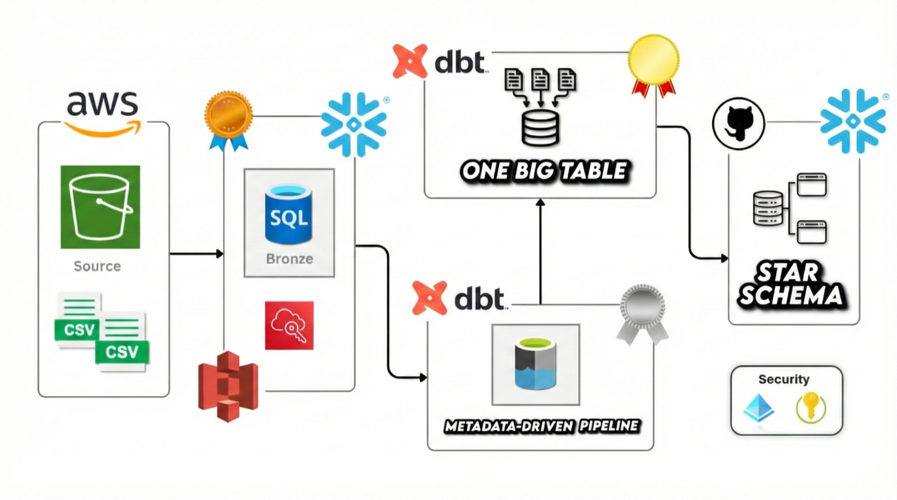
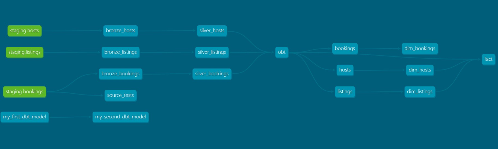

# 🏠 Airbnb Data Pipeline | dbt + Snowflake + AWS S3

A production-ready **ELT data pipeline** built using **dbt (Data Build Tool)** and **Snowflake**, implementing the **Medallion Architecture** (Bronze → Silver → Gold) with incremental loading, SCD Type 2 tracking, and metadata-driven transformations.


---

## 📋 Table of Contents

- [Introduction to Data Engineering](#-introduction-to-data-engineering)
- [ETL vs ELT Paradigm](#-etl-vs-elt-paradigm)
- [What is dbt and Why Use It?](#-what-is-dbt-and-why-use-it)
- [Architecture Overview](#-architecture-overview)
- [The Medallion Architecture](#-the-medallion-architecture)
- [Project Structure](#-project-structure)
- [Prerequisites](#-prerequisites)
- [Setup Guide](#-setup-guide)
- [Understanding Sources in dbt](#-understanding-sources-in-dbt)
- [Bronze Layer - Raw Data Ingestion](#-bronze-layer---raw-data-ingestion)
- [Silver Layer - Transformation](#-silver-layer---transformation)
- [Gold Layer - Business Ready](#-gold-layer---business-ready)
- [Jinja Templating in dbt](#-jinja-templating-in-dbt)
- [Macros - Reusable Functions](#-macros---reusable-functions)
- [Materialization Strategies](#-materialization-strategies)
- [Incremental Loading](#-incremental-loading)
- [SCD Type 2 and Snapshots](#-scd-type-2-and-snapshots)
- [Testing in dbt](#-testing-in-dbt)
- [Running the Pipeline](#-running-the-pipeline)
- [Git Workflow](#-git-workflow)

---

## 📖 Introduction to Data Engineering

### What is Data Engineering?

Data Engineering is the practice of designing, building, and maintaining the infrastructure and architecture for data generation, storage, and analysis. It's the foundation that enables data scientists and analysts to work with clean, reliable, and accessible data.

### The Data Pipeline

A **data pipeline** is a series of processes that move data from source systems to a destination (usually a data warehouse) while transforming it along the way.

```
┌──────────────┐     ┌──────────────┐     ┌──────────────┐     ┌──────────────┐
│    SOURCE    │ ──▶ │   EXTRACT    │ ──▶ │  TRANSFORM   │ ──▶ │     LOAD     │
│   Systems    │     │    Data      │     │    Data      │     │  Warehouse   │
└──────────────┘     └──────────────┘     └──────────────┘     └──────────────┘
```

### Key Challenges in Data Engineering

| Challenge | Description |
|-----------|-------------|
| **Data Volume** | Processing terabytes/petabytes efficiently |
| **Data Velocity** | Handling real-time or near-real-time data |
| **Data Variety** | Dealing with structured, semi-structured, unstructured data |
| **Data Quality** | Ensuring accuracy, completeness, consistency |
| **Data Lineage** | Tracking where data comes from and how it transforms |

---

## 🔄 ETL vs ELT Paradigm

### Traditional ETL (Extract, Transform, Load)

In the traditional approach, data is:
1. **Extracted** from source systems
2. **Transformed** in a separate processing engine (like Informatica, SSIS)
3. **Loaded** into the data warehouse

```
Source ──▶ ETL Server (Transform) ──▶ Data Warehouse
```

**Problems with ETL:**
- Transformation happens outside the warehouse (separate compute)
- Limited by the ETL tool's processing power
- Complex to maintain and scale
- Transformations are often in proprietary languages

### Modern ELT (Extract, Load, Transform)

With modern cloud data warehouses (Snowflake, BigQuery, Redshift), the paradigm shifted:
1. **Extract** data from sources
2. **Load** raw data directly into the warehouse
3. **Transform** inside the warehouse using SQL

```
Source ──▶ Data Warehouse (Load) ──▶ Transform inside Warehouse
```

**Why ELT is Better:**
- Leverages the massive compute power of cloud warehouses
- Transformations in standard SQL (everyone knows SQL!)
- Version controllable (SQL files in Git)
- Scalable - warehouse can auto-scale
- Cheaper - pay for compute only when needed

### Where Does dbt Fit?

**dbt handles the "T" in ELT.** It assumes your data is already loaded into the warehouse and focuses purely on transformation.

```
┌─────────────────────────────────────────────────────────────┐
│                         ELT Pipeline                        │
├─────────────────┬─────────────────┬─────────────────────────┤
│     EXTRACT     │      LOAD       │       TRANSFORM         │
│   (Fivetran,    │   (Snowflake    │         (dbt)           │
│    Airbyte,     │    COPY INTO,   │   SQL + Jinja Models    │
│    Custom)      │    Stages)      │                         │
└─────────────────┴─────────────────┴─────────────────────────┘
```

---

## 🛠 What is dbt and Why Use It?

### The Problem Before dbt

Before dbt, data transformation was painful:

```sql
-- Traditional approach: Manual DDL + DML everywhere
CREATE TABLE IF NOT EXISTS analytics.dim_customers (...);
INSERT INTO analytics.dim_customers SELECT ... FROM ...;
-- Or worse: DROP and recreate every time
DROP TABLE IF EXISTS analytics.dim_customers;
CREATE TABLE analytics.dim_customers AS SELECT ...;
```

**Issues:**
- DDL statements scattered everywhere
- No dependency management
- No testing framework
- No documentation
- Hard to maintain and debug

### How dbt Solves This

**dbt's Philosophy: You write SELECT statements, dbt handles the rest.**

```sql
-- In dbt, you ONLY write this:
SELECT 
    customer_id,
    customer_name,
    created_at
FROM {{ source('raw', 'customers') }}
```

**dbt automatically:**
- Creates the table/view (handles DDL)
- Manages dependencies between models
- Runs tests
- Generates documentation
- Tracks data lineage

### dbt's Key Features

| Feature | What It Does | Why It Matters |
|---------|--------------|----------------|
| **Models** | SQL SELECT statements that become tables/views | Focus on logic, not infrastructure |
| **ref()** | References other models | Automatic dependency management |
| **source()** | References raw data | Clear data lineage |
| **Tests** | Data quality checks | Catch issues early |
| **Documentation** | Auto-generated docs | Always up-to-date docs |
| **Macros** | Reusable SQL functions | DRY (Don't Repeat Yourself) |
| **Snapshots** | SCD Type 2 tracking | Historical data without complex SQL |

### SQL Command Types

Understanding why dbt only needs SELECT statements:

| Command Type | Full Form | Purpose | Example | Who Handles It? |
|--------------|-----------|---------|---------|-----------------|
| **DDL** | Data Definition Language | Define structure | `CREATE TABLE`, `ALTER TABLE`, `DROP` | **dbt** |
| **DML** | Data Manipulation Language | Modify data | `INSERT`, `UPDATE`, `DELETE` | **dbt** |
| **DQL** | Data Query Language | Query data | `SELECT` | **You** |

**You write DQL (SELECT), dbt generates DDL and DML automatically.**

---

## 🏗 Architecture Overview

### High-Level Architecture



### Data Model (Staging Tables)

The raw data consists of 3 tables representing an Airbnb-like booking system:

**HOSTS**
| Column | Type | Description |
|--------|------|-------------|
| host_id | NUMBER | Primary Key |
| host_name | STRING | Host's name |
| host_since | DATE | Date host joined |
| is_superhost | BOOLEAN | Superhost status |
| response_rate | NUMBER | Response rate percentage |
| created_at | TIMESTAMP | Record creation time |

**LISTINGS**
| Column | Type | Description |
|--------|------|-------------|
| listing_id | NUMBER | Primary Key |
| host_id | NUMBER | Foreign Key to HOSTS |
| property_type | STRING | Type of property |
| room_type | STRING | Type of room |
| city | STRING | City location |
| country | STRING | Country location |
| accommodates | NUMBER | Number of guests |
| bedrooms | NUMBER | Number of bedrooms |
| bathrooms | NUMBER | Number of bathrooms |
| price_per_night | NUMBER | Nightly price |
| created_at | TIMESTAMP | Record creation time |

**BOOKINGS**
| Column | Type | Description |
|--------|------|-------------|
| booking_id | STRING | Primary Key |
| listing_id | NUMBER | Foreign Key to LISTINGS |
| booking_date | TIMESTAMP | Date of booking |
| nights_booked | NUMBER | Number of nights |
| booking_amount | NUMBER | Base booking amount |
| cleaning_fee | NUMBER | Cleaning fee |
| service_fee | NUMBER | Service fee |
| booking_status | STRING | Booking status |
| created_at | TIMESTAMP | Record creation time |

### Entity Relationship

```
┌─────────────┐       ┌─────────────┐       ┌─────────────┐
│    HOSTS    │       │  LISTINGS   │       │  BOOKINGS   │
├─────────────┤       ├─────────────┤       ├─────────────┤
│ host_id (PK)│◄──────│ host_id(FK) │       │ booking_id  │
│ host_name   │       │ listing_id  │◄──────│ listing_id  │
│ host_since  │       │ property... │       │ nights...   │
│ is_superhost│       │ price...    │       │ amount...   │
└─────────────┘       └─────────────┘       └─────────────┘
      1                     M                     M
      └────────────────────┘└─────────────────────┘
           One-to-Many            One-to-Many
```

### Why This Architecture?

| Component | Purpose | Why This Choice? |
|-----------|---------|------------------|
| **AWS S3** | Data Lake / Raw Storage | Cheap, durable, scalable object storage |
| **Snowflake Stage** | Bridge between S3 and Snowflake | Native integration, secure IAM-based access |
| **Snowflake** | Data Warehouse | Separates compute/storage, auto-scaling, SQL-based |
| **dbt** | Transformation Layer | SQL-based, version controlled, tested |

### Understanding Snowflake Stages

A **Stage** in Snowflake is a pointer to a storage location (internal or external) where data files are stored.

```sql
-- External Stage pointing to S3
CREATE STAGE airbnb_stage
  STORAGE_INTEGRATION = s3_integration  -- IAM role for authentication
  URL = 's3://snowbuckethash/';
```

**Why Stages?**
- Secure access to cloud storage without exposing credentials
- Enable bulk loading with `COPY INTO` command
- Support for various file formats (CSV, JSON, Parquet, etc.)

---

## 🥇 The Medallion Architecture

### What is Medallion Architecture?

The **Medallion Architecture** (also called Multi-Hop Architecture) is a data design pattern that organizes data into layers of increasing quality and refinement.

```
┌─────────────────────────────────────────────────────────────────────────────┐
│                        MEDALLION ARCHITECTURE                                │
├─────────────────────┬─────────────────────┬─────────────────────────────────┤
│       BRONZE        │       SILVER        │             GOLD                │
│    (Raw Layer)      │  (Cleaned Layer)    │      (Business Layer)           │
├─────────────────────┼─────────────────────┼─────────────────────────────────┤
│ • Raw data as-is    │ • Cleaned data      │ • Aggregated data               │
│ • 1:1 from source   │ • Standardized      │ • Business metrics              │
│ • No transformation │ • Validated         │ • Ready for analytics           │
│ • Audit trail       │ • Enriched          │ • Denormalized                  │
│ • Source of truth   │ • Deduplicated      │ • Optimized for queries         │
└─────────────────────┴─────────────────────┴─────────────────────────────────┘
```

### Why Use Medallion Architecture?

| Benefit | Explanation |
|---------|-------------|
| **Data Quality** | Each layer improves data quality progressively |
| **Debugging** | Can trace issues back through layers |
| **Reprocessing** | Can rebuild Silver/Gold from Bronze if logic changes |
| **Flexibility** | Different consumers can use appropriate layer |
| **Governance** | Clear data lineage and audit trail |

### Our Implementation

| Layer | Schema | Tables | Materialization |
|-------|--------|--------|-----------------|
| **Bronze** | `AIRBNB.BRONZE` | bronze_bookings, bronze_hosts, bronze_listings | incremental |
| **Silver** | `AIRBNB.SILVER` | silver_bookings, silver_hosts, silver_listings | incremental |
| **Gold** | `AIRBNB.GOLD` | obt, fact, dim_* (snapshots) | table |

---

## 📁 Project Structure

### dbt Project Anatomy

When you run `dbt init`, it creates a standard project structure:

```
aws_dbt_snowflake_project/
│
├── dbt_project.yml            # 🎯 Project configuration (name, paths, materializations)
├── profiles.yml               # 🔐 Database connection settings (usually in ~/.dbt/)
│
├── models/                    # 📊 SQL transformation models
│   ├── bronze/                # Raw data layer
│   │   ├── bronze_bookings.sql
│   │   ├── bronze_hosts.sql
│   │   ├── bronze_listings.sql
│   │   └── properties.yml     # Model-level configs and tests
│   │
│   ├── silver/                # Cleaned/transformed layer
│   │   ├── silver_bookings.sql
│   │   ├── silver_hosts.sql
│   │   └── silver_listings.sql
│   │
│   ├── gold/                  # Business-ready layer
│   │   ├── obt.sql           # One Big Table (denormalized)
│   │   ├── fact.sql          # Fact table for star schema
│   │   └── ephemeral/        # CTE models (no physical table)
│   │       ├── bookings.sql
│   │       ├── hosts.sql
│   │       └── listings.sql
│   │
│   └── sources/
│       └── sources.yml        # Define raw data sources
│
├── macros/                    # 🔧 Reusable SQL functions
│   ├── generate_schema_name.sql
│   ├── multiply.sql
│   └── tag.sql
│
├── snapshots/                 # 📸 SCD Type 2 definitions
│   ├── dim_bookings.yml
│   ├── dim_hosts.yml
│   └── dim_listings.yml
│
├── tests/                     # ✅ Custom data quality tests
│   └── source_tests.sql
│
├── seeds/                     # 🌱 CSV files to load as tables
├── analyses/                  # 📈 Ad-hoc analytical queries
└── logs/                      # 📝 dbt execution logs
```

### Understanding dbt_project.yml

This is the heart of your dbt project:

```yaml
# Project identity
name: 'aws_dbt_snowflake_project'
version: '1.0.0'
profile: 'aws_dbt_snowflake_project'  # Links to profiles.yml

# Path configurations
model-paths: ["models"]
analysis-paths: ["analyses"]
test-paths: ["tests"]
seed-paths: ["seeds"]
macro-paths: ["macros"]
snapshot-paths: ["snapshots"]

# Model configurations by folder
models:
  aws_dbt_snowflake_project:
    bronze:
      +materialized: table      # Create physical tables
      +schema: bronze           # Target schema name
    silver:
      +materialized: incremental
      +schema: silver
    gold:
      +materialized: table
      +schema: gold
      ephemeral:
        +materialized: ephemeral  # No physical table, inline as CTE
```

---

## ⚙ Prerequisites

### Required Software

| Software | Version | Purpose |
|----------|---------|---------|
| Python | 3.12+ | dbt runtime |
| Git | Latest | Version control |
| VS Code | Latest | Code editor (recommended) |

### Required Accounts

| Service | Purpose | What You Need |
|---------|---------|---------------|
| AWS Account | S3 storage for raw data | S3 bucket, IAM role |
| Snowflake Account | Data warehouse | Account URL, credentials |

---

## 🚀 Setup Guide

### Step 1: AWS S3 Setup

**1.1 Create S3 Bucket**

```
Bucket Name: snowbuckethash (or your choice)
Region: Choose closest to your Snowflake region
```

**1.2 Create Folder Structure**

```
snowbuckethash/
└── airbnb/
    ├── listings.csv
    ├── bookings.csv
    └── hosts.csv
```

**1.3 Create IAM Role for Snowflake**

IAM (Identity and Access Management) allows Snowflake to securely access S3 without storing AWS credentials.

```json
{
  "Version": "2012-10-17",
  "Statement": [
    {
      "Effect": "Allow",
      "Action": [
        "s3:GetObject",
        "s3:GetObjectVersion",
        "s3:ListBucket"
      ],
      "Resource": [
        "arn:aws:s3:::snowbuckethash",
        "arn:aws:s3:::snowbuckethash/*"
      ]
    }
  ]
}
```

### Step 2: Snowflake Configuration

**2.1 Create Database and Schema**

```sql
-- Create the main database
CREATE DATABASE AIRBNB;

-- Create staging schema for raw data
CREATE SCHEMA AIRBNB.STAGING;
```

**2.2 Create Staging Tables**

Create tables with proper schema definitions:

```sql
USE DATABASE AIRBNB;
USE SCHEMA STAGING;

-- Hosts table
CREATE OR REPLACE TABLE HOSTS (
    host_id NUMBER,
    host_name STRING,
    host_since DATE,
    is_superhost BOOLEAN,
    response_rate NUMBER,
    created_at TIMESTAMP,
    PRIMARY KEY (host_id)
);

-- Listings table
CREATE OR REPLACE TABLE LISTINGS (
    listing_id NUMBER,
    host_id NUMBER,
    property_type STRING,
    room_type STRING,
    city STRING,
    country STRING,
    accommodates NUMBER,
    bedrooms NUMBER,
    bathrooms NUMBER,
    price_per_night NUMBER,
    created_at TIMESTAMP,
    PRIMARY KEY (listing_id)
);

-- Bookings table
CREATE OR REPLACE TABLE BOOKINGS (
    booking_id STRING,
    listing_id NUMBER,
    booking_date TIMESTAMP,
    nights_booked NUMBER,
    booking_amount NUMBER,
    cleaning_fee NUMBER,
    service_fee NUMBER,
    booking_status STRING,
    created_at TIMESTAMP,
    PRIMARY KEY (booking_id)
);
```

**2.3 Create File Format and External Stage**

```sql
-- Create CSV file format
CREATE FILE FORMAT IF NOT EXISTS csv_format
  TYPE = 'CSV' 
  FIELD_DELIMITER = ','
  SKIP_HEADER = 1
  ERROR_ON_COLUMN_COUNT_MISMATCH = FALSE;

-- Create external stage pointing to S3
CREATE OR REPLACE STAGE snowstage
  FILE_FORMAT = csv_format
  URL = 's3://snowbuckethash/source/';

-- Verify stage creation
SHOW STAGES;
```

**2.4 Load Data from S3 into Staging Tables**

```sql
-- Load bookings data
COPY INTO BOOKINGS
FROM @snowstage
FILES = ('bookings.csv')
CREDENTIALS = (aws_key_id = 'YOUR_AWS_KEY', aws_secret_key = 'YOUR_AWS_SECRET');

-- Load listings data
COPY INTO LISTINGS
FROM @snowstage
FILES = ('listings.csv')
CREDENTIALS = (aws_key_id = 'YOUR_AWS_KEY', aws_secret_key = 'YOUR_AWS_SECRET');

-- Load hosts data
COPY INTO HOSTS
FROM @snowstage
FILES = ('hosts.csv')
CREDENTIALS = (aws_key_id = 'YOUR_AWS_KEY', aws_secret_key = 'YOUR_AWS_SECRET');

-- Verify data loaded
SELECT * FROM HOSTS;
SELECT * FROM LISTINGS;
SELECT * FROM BOOKINGS;
```

> ⚠️ **Security Note:** Never commit AWS credentials to version control. Use environment variables or Snowflake's Storage Integration for production environments.

### Step 3: Python Environment Setup

**Why uv?**
`uv` is a modern Python package manager that's faster than pip and handles virtual environments seamlessly.

```bash
# Install uv
pip install uv

# Create project directory
mkdir aws_dbt_snowflake
cd aws_dbt_snowflake

# Initialize Python project
uv init

# Create virtual environment and install dependencies
uv sync

# Install dbt with Snowflake adapter
uv add dbt-core
uv add dbt-snowflake
```

### Step 4: Initialize dbt Project

```bash
# Initialize new dbt project
dbt init aws_dbt_snowflake_project
```

When prompted:

```
Enter a name for your project: aws_dbt_snowflake_project
Which database would you like to use?
[1] snowflake
Enter a number: 1

account: YOUR_SNOWFLAKE_ACCOUNT
user: YOUR_USERNAME
password: YOUR_PASSWORD
role: YOUR_ROLE
warehouse: YOUR_WAREHOUSE
database: AIRBNB
schema: dbt_schema
threads: 4
```

### Step 5: Verify Connection

```bash
cd aws_dbt_snowflake_project
dbt debug
```

Expected output:
```
Connection test: OK
All checks passed!
```

---

## 📥 Understanding Sources in dbt

### What are Sources?

**Sources** are declarations of your raw data tables. They tell dbt where your data comes from.

### Why Define Sources?

| Benefit | Explanation |
|---------|-------------|
| **Documentation** | Clear record of raw data origins |
| **Lineage** | dbt can trace data from raw to final |
| **Testing** | Apply tests to source data |
| **Freshness** | Check if source data is up-to-date |

### Defining Sources

```yaml
# models/sources/sources.yml

sources:
  - name: staging              # Logical name for this source group
    database: AIRBNB           # Snowflake database
    schema: staging            # Snowflake schema
    tables:
      - name: listings         # Table name
      - name: bookings
      - name: hosts
```

### Using Sources in Models

```sql
-- Instead of hardcoding:
SELECT * FROM AIRBNB.STAGING.LISTINGS

-- Use the source() function:
SELECT * FROM {{ source('staging', 'listings') }}
```

**Why source() is better:**
- If table location changes, update only sources.yml
- Automatic lineage tracking
- Can add freshness checks and tests

---

## 🥉 Bronze Layer - Raw Data Ingestion

### Purpose

The Bronze layer is your **raw data landing zone**. It's a 1:1 copy of source data with minimal transformation.

### Design Principles

| Principle | Explanation |
|-----------|-------------|
| **Preserve Raw Data** | Keep data exactly as received from source |
| **Add Metadata** | Optionally add load timestamps, source info |
| **Incremental Loading** | Only load new/changed records |
| **Audit Trail** | Bronze is your "source of truth" for debugging |

### Implementation: bronze_bookings.sql

```sql
-- models/bronze/bronze_bookings.sql

{{ config(materialized='incremental') }}

SELECT * FROM {{ source('staging', 'bookings') }}


    WHERE CREATED_AT > (SELECT COALESCE(MAX(CREATED_AT), '1900-01-01') FROM {{ this }})

```

**Code Breakdown:**

| Element | Purpose |
|---------|---------|
| `{{ config(materialized='incremental') }}` | Use incremental materialization |
| `{{ source('staging', 'bookings') }}` | Reference raw source table |
| `` | Jinja conditional for incremental logic |
| `{{ this }}` | References the current model (bronze_bookings) |
| `COALESCE(..., '1900-01-01')` | Handle first run when table is empty |

### Similar Models

**bronze_hosts.sql:**
```sql
{{ config(materialized='incremental') }}

SELECT * FROM {{ source('staging', 'hosts') }}


    WHERE CREATED_AT > (SELECT COALESCE(MAX(CREATED_AT), '1900-01-01') FROM {{ this }})

```

**bronze_listings.sql:**
```sql
{{ config(materialized='incremental') }}

SELECT * FROM {{ source('staging', 'listings') }}


    WHERE CREATED_AT > (SELECT COALESCE(MAX(CREATED_AT), '1900-01-01') FROM {{ this }})

```

---

## 🥈 Silver Layer - Transformation

### Purpose

The Silver layer is where **business logic lives**. It's cleaned, validated, and enriched data.

### Transformations Applied

| Type | Example | Why? |
|------|---------|------|
| **Data Cleaning** | `REPLACE(HOST_NAME, ' ', '_')` | Standardize formats |
| **Data Enrichment** | Add `RESPONSE_RATE_QUALITY` derived column | Business context |
| **Calculations** | `NIGHTS_BOOKED * BOOKING_AMOUNT` | Computed metrics |
| **Categorization** | Price tags (low/medium/high) | Analytical grouping |

### Implementation: silver_hosts.sql

```sql
-- models/silver/silver_hosts.sql

{{ config(materialized='incremental', unique_key='HOST_ID') }}

SELECT 
    HOST_ID,
    REPLACE(HOST_NAME, ' ', '_') AS HOST_NAME,      -- Clean: Replace spaces
    HOST_SINCE,
    IS_SUPERHOST,
    RESPONSE_RATE,
    CASE                                             -- Enrich: Add quality tier
        WHEN RESPONSE_RATE > 95 THEN 'VERY GOOD'
        WHEN RESPONSE_RATE > 80 THEN 'GOOD'
        WHEN RESPONSE_RATE > 60 THEN 'FAIR'
        ELSE 'POOR'
    END AS RESPONSE_RATE_QUALITY,
    CREATED_AT
FROM 
    {{ ref('bronze_hosts') }}                        -- Reference bronze layer
```

**Code Breakdown:**

| Element | Purpose |
|---------|---------|
| `unique_key='HOST_ID'` | For incremental: update existing rows, insert new |
| `REPLACE(HOST_NAME, ' ', '_')` | Data standardization |
| `CASE WHEN...` | Derived column for business categorization |
| `{{ ref('bronze_hosts') }}` | Reference bronze model (creates dependency) |

### Implementation: silver_bookings.sql

```sql
{{ config(materialized='incremental', unique_key='BOOKING_ID') }}

SELECT 
    BOOKING_ID,
    LISTING_ID,
    BOOKING_DATE,
    {{ multiply('NIGHTS_BOOKED', 'BOOKING_AMOUNT', 2) }} AS TOTAL_AMOUNT,  -- Macro usage
    SERVICE_FEE, 
    CLEANING_FEE, 
    BOOKING_STATUS,
    CREATED_AT
FROM 
    {{ ref('bronze_bookings') }}
```

### Implementation: silver_listings.sql

```sql
{{ config(materialized='incremental', unique_key='LISTING_ID') }}

SELECT 
    LISTING_ID,
    HOST_ID,
    PROPERTY_TYPE,
    ROOM_TYPE,
    CITY,
    COUNTRY,
    ACCOMMODATES,
    BEDROOMS,
    BATHROOMS,
    PRICE_PER_NIGHT,
    {{ tag('CAST(PRICE_PER_NIGHT AS INT)') }} AS PRICE_PER_NIGHT_TAG,  -- Macro usage
    CREATED_AT
FROM 
    {{ ref('bronze_listings') }}
```

### The ref() Function

**What it does:**
- Creates a dependency between models
- Generates correct table name based on environment
- Enables automatic execution order

```sql
{{ ref('bronze_bookings') }}

-- Compiles to:
AIRBNB.BRONZE.bronze_bookings
```

---

## 🥇 Gold Layer - Business Ready

### Purpose

The Gold layer contains **business-ready, aggregated data** optimized for analytics and reporting.

### Key Concepts

| Concept | Description |
|---------|-------------|
| **Denormalization** | Combine multiple tables into fewer, wider tables |
| **OBT (One Big Table)** | Single table with all needed columns for analysis |
| **Fact Tables** | Measurable events (bookings, transactions) |
| **Dimension Tables** | Descriptive attributes (hosts, listings) |

### One Big Table (OBT) Pattern

The OBT pattern denormalizes data into a single wide table, making queries simpler and faster.

**Pros:**
- Simple queries (no joins needed)
- Fast for BI tools
- Easy to understand

**Cons:**
- Data redundancy
- Larger storage
- Updates affect entire table

### Implementation: obt.sql (Metadata-Driven)

This is the most sophisticated part of the project - a **metadata-driven pipeline**:

```sql
-- models/gold/obt.sql

-- Declare refs explicitly for dbt lineage detection




-- Configuration array defining the join logic
{% set configs = [
    {
        "ref" : _silver_bookings,
        "columns" : "SILVER_bookings.*",
        "alias" : "SILVER_bookings"
    },
    { 
        "ref" : _silver_listings,
        "columns" : "SILVER_listings.HOST_ID, SILVER_listings.PROPERTY_TYPE, SILVER_listings.ROOM_TYPE, SILVER_listings.CITY, SILVER_listings.COUNTRY, SILVER_listings.ACCOMMODATES, SILVER_listings.BEDROOMS, SILVER_listings.BATHROOMS, SILVER_listings.PRICE_PER_NIGHT, SILVER_listings.PRICE_PER_NIGHT_TAG, SILVER_listings.CREATED_AT AS LISTING_CREATED_AT",
        "alias" : "SILVER_listings",
        "join_condition" : "SILVER_bookings.listing_id = SILVER_listings.listing_id"
    },
    {
        "ref" : _silver_hosts,
        "columns" : "SILVER_hosts.HOST_NAME, SILVER_hosts.HOST_SINCE, SILVER_hosts.IS_SUPERHOST, SILVER_hosts.RESPONSE_RATE, SILVER_hosts.RESPONSE_RATE_QUALITY, SILVER_hosts.CREATED_AT AS HOST_CREATED_AT",
        "alias" : "SILVER_hosts",
        "join_condition" : "SILVER_listings.host_id = SILVER_hosts.host_id"
    }
] %}

-- Dynamic SELECT clause
SELECT 
    
        {{ config['columns'] }},
    
FROM
    -- Dynamic FROM and JOIN clause
    
        
            {{ config['ref'] }} AS {{ config['alias'] }}
        
            LEFT JOIN {{ config['ref'] }} AS {{ config['alias'] }}
            ON {{ config['join_condition'] }}
        
    
```

**Why Metadata-Driven?**

| Traditional Approach | Metadata-Driven Approach |
|---------------------|-------------------------|
| Hard-coded joins | Joins defined in config array |
| Adding table = rewrite SQL | Adding table = add config entry |
| Error-prone | Consistent pattern |
| Hard to maintain | Easy to extend |

### Ephemeral Models

**What are Ephemeral Models?**

Ephemeral models don't create physical tables. They're compiled as **CTEs (Common Table Expressions)** into downstream models.

```sql
-- models/gold/ephemeral/bookings.sql

{{
  config(
    materialized = 'ephemeral',
  )
}}

WITH bookings AS 
(
    SELECT 
        BOOKING_ID,
        BOOKING_DATE,
        BOOKING_STATUS,
        CREATED_AT
    FROM 
        {{ ref('obt') }}
)
SELECT * FROM bookings
```

**When to Use Ephemeral:**
- Intermediate transformations
- Don't need to query directly
- Reduce table count in warehouse
- Performance optimization (avoid table scans)

**When NOT to Use Ephemeral:**
- Need to query the table directly
- Multiple models reference it (causes code duplication)
- Need to track lineage in warehouse

### Fact Table: fact.sql

```sql
-- models/gold/fact.sql





{% set configs = [
    {
        "ref" : _obt,
        "columns" : "GOLD_obt.BOOKING_ID, GOLD_obt.LISTING_ID, GOLD_obt.HOST_ID, GOLD_obt.TOTAL_AMOUNT, GOLD_obt.SERVICE_FEE, GOLD_obt.CLEANING_FEE, GOLD_obt.ACCOMMODATES, GOLD_obt.BEDROOMS, GOLD_obt.BATHROOMS, GOLD_obt.PRICE_PER_NIGHT, GOLD_obt.RESPONSE_RATE",
        "alias" : "GOLD_obt"
    },
    { 
        "ref" : _dim_listings,
        "columns" : "",
        "alias" : "DIM_listings",
        "join_condition" : "GOLD_obt.listing_id = DIM_listings.listing_id"
    },
    {
        "ref" : _dim_hosts,
        "columns" : "",
        "alias" : "DIM_hosts",
        "join_condition" : "GOLD_obt.host_id = DIM_hosts.host_id"
    }
] %}

SELECT 
    {{ configs[0]['columns'] }}
FROM
    
        
            {{ config['ref'] }} AS {{ config['alias'] }}
        
            LEFT JOIN {{ config['ref'] }} AS {{ config['alias'] }}
            ON {{ config['join_condition'] }}
        
    
```

---

## 🎨 Jinja Templating in dbt

### What is Jinja?

**Jinja** is a templating language for Python. dbt uses Jinja to make SQL dynamic and programmable.

### Jinja Syntax Overview

| Syntax | Purpose | Example |
|--------|---------|---------|
| `{{ }}` | Output/Expression | `{{ ref('model') }}` |
| `` | Statement/Logic | `` |
| `{# #}` | Comment | `{# This is a comment #}` |

### Variables

```sql
-- Set a variable


-- Use the variable
SELECT * FROM table WHERE {{ my_column }} > '2024-01-01'
```

### Conditionals (if-else)

```sql


SELECT * FROM {{ ref('bronze_bookings') }}


    WHERE NIGHTS_BOOKED > 1

    WHERE NIGHTS_BOOKED = 1

```

### Loops

```sql


SELECT
    
        {{ col }},
    
FROM {{ ref('bronze_bookings') }}

-- Compiles to:
SELECT
    NIGHTS_BOOKED,
    BOOKING_ID,
    AMOUNT
FROM ...
```

### Loop Properties

| Property | Description |
|----------|-------------|
| `loop.first` | True if first iteration |
| `loop.last` | True if last iteration |
| `loop.index` | Current iteration (1-indexed) |
| `loop.index0` | Current iteration (0-indexed) |

### Practical Example from Project

```sql
-- Dynamic SELECT with loop
SELECT 
    
        {{ config['columns'] }},
    
FROM ...

-- Compiles to:
SELECT 
    SILVER_bookings.*,
    SILVER_listings.HOST_ID, SILVER_listings.PROPERTY_TYPE, ...,
    SILVER_hosts.HOST_NAME, SILVER_hosts.HOST_SINCE, ...
FROM ...
```

---

## 🔧 Macros - Reusable Functions

### What are Macros?

**Macros** are reusable pieces of Jinja/SQL code. Think of them as **functions** that can be called from any model.

### Why Use Macros?

| Benefit | Explanation |
|---------|-------------|
| **DRY Principle** | Don't Repeat Yourself - write once, use everywhere |
| **Consistency** | Same logic applied consistently across models |
| **Maintainability** | Change logic in one place, affects all usages |
| **Testability** | Can test macro logic independently |

### Macro 1: generate_schema_name

**Purpose:** Override dbt's default schema naming behavior.

By default, dbt creates schemas like `dbt_schema_bronze`. This macro removes the prefix to get clean schema names like just `bronze`.

```sql
-- macros/generate_schema_name.sql



    
    
    
        {{ default_schema }}
    
        {{ custom_schema_name | trim }}
    


```

**How it works:**

| Scenario | Default dbt Behavior | With This Macro |
|----------|---------------------|-----------------|
| No custom schema | `dbt_schema` | `dbt_schema` |
| Custom schema = 'bronze' | `dbt_schema_bronze` | `bronze` |

### Macro 2: multiply

**Purpose:** Reusable calculation with precision control.

```sql
-- macros/multiply.sql


    round({{ x }} * {{ y }}, {{ precision }})

```

**Usage:**
```sql
-- In silver_bookings.sql
{{ multiply('NIGHTS_BOOKED', 'BOOKING_AMOUNT', 2) }} AS TOTAL_AMOUNT

-- Compiles to:
round(NIGHTS_BOOKED * BOOKING_AMOUNT, 2) AS TOTAL_AMOUNT
```

### Macro 3: tag

**Purpose:** Categorize numeric values into buckets.

```sql
-- macros/tag.sql


    CASE 
        WHEN {{ col }} < 100 THEN 'low'
        WHEN {{ col }} < 200 THEN 'medium'
        ELSE 'high'
    END

```

**Usage:**
```sql
-- In silver_listings.sql
{{ tag('CAST(PRICE_PER_NIGHT AS INT)') }} AS PRICE_PER_NIGHT_TAG

-- Compiles to:
CASE 
    WHEN CAST(PRICE_PER_NIGHT AS INT) < 100 THEN 'low'
    WHEN CAST(PRICE_PER_NIGHT AS INT) < 200 THEN 'medium'
    ELSE 'high'
END AS PRICE_PER_NIGHT_TAG
```

---

## 📦 Materialization Strategies

### What is Materialization?

**Materialization** determines how dbt persists your model in the warehouse.

### Materialization Types

| Type | Creates Physical Table? | How It Works | Best For |
|------|------------------------|--------------|----------|
| **table** | Yes | DROP and CREATE every run | Final outputs, small tables |
| **view** | No (virtual) | CREATE VIEW | Lightweight, always fresh |
| **incremental** | Yes | INSERT/MERGE new records | Large tables, append-only |
| **ephemeral** | No | Inline as CTE | Intermediate steps |

### Configuration Precedence

dbt allows configuration at multiple levels. Higher levels override lower:

```
┌─────────────────────────────────────────────────────┐
│          MOST POWERFUL (Wins Conflicts)             │
├─────────────────────────────────────────────────────┤
│  1. Inline Config (in .sql file)                    │
│     {{ config(materialized='table') }}              │
├─────────────────────────────────────────────────────┤
│  2. Model YAML (properties.yml)                     │
│     models:                                         │
│       - name: my_model                              │
│         config:                                     │
│           materialized: table                       │
├─────────────────────────────────────────────────────┤
│  3. dbt_project.yml (folder level)                  │
│     models:                                         │
│       project_name:                                 │
│         bronze:                                     │
│           +materialized: table                      │
├─────────────────────────────────────────────────────┤
│          LEAST POWERFUL (Default)                   │
└─────────────────────────────────────────────────────┘
```

### Our Configuration

```yaml
# dbt_project.yml

models:
  aws_dbt_snowflake_project:
    bronze:
      +materialized: table
      +schema: bronze
    silver:
      +materialized: incremental
      +schema: silver
    gold:
      +materialized: table
      +schema: gold
      ephemeral:
        +materialized: ephemeral
```

---

## 📈 Incremental Loading

### The Problem with Full Refresh

Imagine a table with 1 billion rows. Every day, 100,000 new rows arrive.

| Approach | Rows Processed | Time | Cost |
|----------|---------------|------|------|
| Full Refresh | 1,000,000,000 | Hours | $$$ |
| Incremental | 100,000 | Minutes | $ |

### How Incremental Works

**Initial Load (First Run):**
- dbt creates table
- Loads ALL data from source

**Subsequent Runs:**
- dbt identifies NEW records only
- Inserts/Merges only new records

### Implementation Pattern

```sql
{{ config(
    materialized='incremental',
    unique_key='BOOKING_ID'  -- Optional: enables UPDATE for existing keys
) }}

SELECT * FROM {{ source('staging', 'bookings') }}


    -- This WHERE clause only runs on incremental runs, not initial load
    WHERE CREATED_AT > (SELECT MAX(CREATED_AT) FROM {{ this }})

```

### Key Functions

| Function | Purpose |
|----------|---------|
| `is_incremental()` | Returns TRUE if model exists and is running incrementally |
| `{{ this }}` | References the current model's table |

### Incremental Strategies

| Strategy | How It Works | Use When |
|----------|--------------|----------|
| **Append** (default) | Just INSERT new rows | No updates to existing data |
| **Merge** (unique_key) | UPDATE existing, INSERT new | Records can be updated |
| **Delete+Insert** | Delete matching rows, insert new | Need to replace records |

### Full Refresh Override

Sometimes you need to rebuild the entire table:

```bash
dbt run --full-refresh
```

This ignores `is_incremental()` and rebuilds from scratch.

---

## 📸 SCD Type 2 and Snapshots

### What is SCD (Slowly Changing Dimension)?

In data warehousing, dimension data changes over time. **SCD** strategies define how to handle these changes.

### SCD Types

| Type | Strategy | Example | Pros | Cons |
|------|----------|---------|------|------|
| **Type 0** | Never update | Static data | Simple | No history |
| **Type 1** | Overwrite | `UPDATE host SET name = 'New'` | Simple | Loses history |
| **Type 2** | Add new row | Insert new row, expire old | Full history | Complex queries |
| **Type 3** | Add column | `previous_name`, `current_name` | Some history | Limited history |

### SCD Type 2 in Detail

When a value changes, instead of updating, we:
1. **Expire** the old record (set end date)
2. **Insert** a new record (with new start date)

**Example: Host becomes Superhost**

| HOST_ID | HOST_NAME | IS_SUPERHOST | dbt_valid_from | dbt_valid_to |
|---------|-----------|--------------|----------------|--------------|
| 101 | John | FALSE | 2024-01-01 | 2024-06-15 |
| 101 | John | TRUE | 2024-06-15 | 9999-12-31 |

**Reading the data:**
- Current record: `dbt_valid_to = '9999-12-31'`
- Historical record: `dbt_valid_to < '9999-12-31'`

### dbt Snapshots

dbt **Snapshots** implement SCD Type 2 automatically!

```yaml
# snapshots/dim_hosts.yml

snapshots:
  - name: dim_hosts
    relation: ref('hosts')        # Source model (ephemeral)
    config:
      schema: gold
      database: AIRBNB
      unique_key: HOST_ID         # Primary key
      strategy: timestamp         # Change detection strategy
      updated_at: HOST_CREATED_AT # Column to detect changes
      dbt_valid_to_current: "to_date('9999-12-31')"  # Value for current records
```

### Snapshot Strategies

| Strategy | How It Detects Changes | Best For |
|----------|----------------------|----------|
| **timestamp** | Compares `updated_at` column | Tables with reliable timestamp |
| **check** | Compares specified columns | Tables without timestamp |

### Running Snapshots

```bash
dbt snapshot
```

This command:
1. Compares source to existing snapshot
2. Expires changed records (sets `dbt_valid_to`)
3. Inserts new records (sets `dbt_valid_from`)

### All Snapshot Configurations

**dim_bookings.yml:**
```yaml
snapshots:
  - name: dim_bookings
    relation: ref('bookings')
    config:
      schema: gold
      database: AIRBNB
      unique_key: BOOKING_ID
      strategy: timestamp
      updated_at: CREATED_AT
      dbt_valid_to_current: "to_date('9999-12-31')"
```

**dim_listings.yml:**
```yaml
snapshots:
  - name: dim_listings
    relation: ref('listings')
    config:
      schema: gold
      database: AIRBNB
      unique_key: LISTING_ID
      strategy: timestamp
      updated_at: LISTING_CREATED_AT
      dbt_valid_to_current: "to_date('9999-12-31')"
```

---

## ✅ Testing in dbt

### Why Test Data?

| Issue | Impact | Testing Prevents |
|-------|--------|------------------|
| NULL primary keys | Duplicate records | `not_null` test |
| Duplicate IDs | Incorrect aggregations | `unique` test |
| Invalid references | Broken joins | `relationships` test |
| Invalid values | Wrong calculations | `accepted_values` test |

### Built-in Tests

dbt provides 4 generic tests:

| Test | Purpose | Example |
|------|---------|---------|
| `unique` | No duplicate values | Primary keys |
| `not_null` | No NULL values | Required fields |
| `accepted_values` | Only allowed values | Status columns |
| `relationships` | Foreign key exists | ID references |

### Custom Tests

You can write custom SQL tests:

```sql
-- tests/source_tests.sql

{{ config(severity='warn') }}

SELECT 1
FROM {{ source('staging','bookings') }}
WHERE BOOKING_AMOUNT < 200
```

**How it works:**
- Test PASSES if query returns 0 rows
- Test FAILS if query returns any rows
- `severity='warn'` logs warning but doesn't fail pipeline

### Running Tests

```bash
# Run all tests
dbt test

# Run tests for specific model
dbt test --select bronze_bookings

# Run only source tests
dbt test --select source:*
```

---

## ▶ Running the Pipeline

### Complete dbt Command Reference

| Command | Purpose |
|---------|---------|
| `dbt debug` | Test connection and configuration |
| `dbt deps` | Install package dependencies |
| `dbt seed` | Load CSV files from seeds/ |
| `dbt run` | Execute all models |
| `dbt test` | Run all tests |
| `dbt snapshot` | Execute snapshots |
| `dbt build` | Run + Test + Snapshot (all in one) |
| `dbt docs generate` | Generate documentation |
| `dbt docs serve` | Serve docs on localhost |
| `dbt clean` | Remove target/ and dbt_packages/ |

### Selective Execution

```bash
# Run specific model
dbt run --select bronze_bookings

# Run folder
dbt run --select bronze

# Run model and its dependencies
dbt run --select +gold.obt

# Run model and its dependents
dbt run --select bronze_bookings+

# Run with full refresh
dbt run --full-refresh
```

### Typical Execution Order

```bash
# 1. Verify setup
dbt debug

# 2. Install dependencies
dbt deps

# 3. Run models (Bronze → Silver → Gold)
dbt run

# 4. Run tests
dbt test

# 5. Run snapshots
dbt snapshot

# 6. Generate and view docs
dbt docs generate
dbt docs serve
```

---

## 🔀 Git Workflow

### Branch Strategy

```
main (production)
  │
  └── feature/add-new-model
        │
        ├── Develop locally
        ├── Test with dbt run
        ├── Commit changes
        └── Merge to main
```

### Common Commands

```bash
# Create feature branch
git checkout -b feature/add-silver-models

# Stage changes
git add .

# Commit
git commit -m "Add silver layer models with transformations"

# Switch to main
git checkout main

# Merge feature
git merge feature/add-silver-models

# Push to remote
git push origin main
```

### Best Practices

| Practice | Why |
|----------|-----|
| Small, focused commits | Easy to review and rollback |
| Descriptive commit messages | Clear history |
| Feature branches | Isolate changes |
| Test before merging | Prevent broken code in main |

---

## 📊 Data Lineage

dbt automatically tracks data lineage:




**View in dbt:**
```bash
dbt docs generate
dbt docs serve
# Open http://localhost:8080
```

---

## 📚 Key Learnings Summary

| Concept | What You Learned |
|---------|------------------|
| **ELT > ETL** | Transform in warehouse, not outside |
| **dbt Philosophy** | Write SELECT, dbt handles DDL/DML |
| **Medallion Architecture** | Bronze → Silver → Gold quality layers |
| **Incremental Models** | Process only new data, save compute |
| **Jinja Templating** | Variables, loops, conditionals in SQL |
| **Macros** | DRY principle - reusable SQL functions |
| **Materialization** | table, view, incremental, ephemeral |
| **SCD Type 2** | Track history with snapshots |
| **ref() & source()** | Dependency management and lineage |
| **Metadata-Driven** | Config changes over code changes |

---

## 🛠 Tech Stack Summary

| Layer | Technology | Purpose |
|-------|------------|---------|
| **Storage** | AWS S3 | Data lake / raw file storage |
| **Warehouse** | Snowflake | Cloud data warehouse |
| **Transformation** | dbt Core | SQL-based transformations |
| **Templating** | Jinja | Dynamic SQL generation |
| **Version Control** | Git | Code versioning |
| **Package Manager** | uv | Python dependency management |

---

## 🔗 Resources

- [dbt Documentation](https://docs.getdbt.com/)
- [Snowflake Documentation](https://docs.snowflake.com/)
- [Jinja Documentation](https://jinja.palletsprojects.com/)
- [Medallion Architecture](https://www.databricks.com/glossary/medallion-architecture)

---


